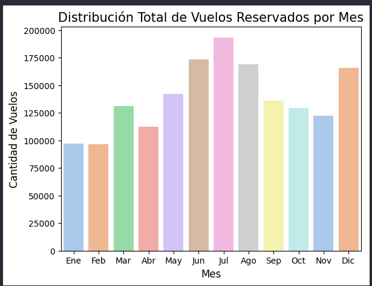

Análisis de Fidelización de Clientes: Aerolínea ✈️
Este proyecto consiste en un análisis integral de datos de una aerolínea para entender el comportamiento de sus clientes en relación con su programa de lealtad, salarios y hábitos de vuelo. El objetivo es identificar patrones que permitan mejorar las estrategias de marketing y retención.

📋 Estructura del Proyecto
El análisis se divide en tres fases críticas que cubren desde el procesamiento de datos brutos hasta la validación estadística y la comunicación visual.

🛠️ Fase 1: Exploración y Limpieza de Datos
En esta etapa, unificamos dos fuentes de datos y corregimos inconsistencias para garantizar un análisis fiable.

Hito clave: Imputación de nulos en la columna salary utilizando la media segmentada por nivel educativo.

Ejemplo de código:

Python
# Imputación de nulos basada en el nivel educativo
df_unido['salary'] = df_unido.groupby('education')['salary'].transform(lambda x: x.fillna(x.mean()))

# Corrección de errores en distancias (valores negativos)
df_unido['distance'] = df_unido['distance'].abs()
📊 Fase 2: Análisis Estadístico
Realizamos un análisis descriptivo y aplicamos estadística inferencial para validar hipótesis de negocio.

Hito clave: Uso de pruebas no paramétricas (Mann-Whitney U) tras comprobar la falta de normalidad en los datos.

Ejemplo de código:

Python
# Prueba A/B: ¿Hay diferencia de salario entre Bachelor y College?
from scipy.stats import mannwhitneyu

stat, p_value = mannwhitneyu(salario_bachelor, salario_college)
print(f"p-valor: {p_value}") 
# Resultado: p < 0.05 -> Diferencia estadísticamente significativa.
📈 Fase 3: Visualización de Datos
Creamos un dashboard visual para comunicar los hallazgos de forma efectiva, utilizando paletas de colores coherentes y gráficos avanzados.

Hito clave: Análisis de la relación entre nivel educativo, género y comportamiento de reserva.

Ejemplo de código:

Python
# Visualización de la distribución de clientes por estado civil y género
# 1. ¿Cómo se distribuye la cantidad de vuelos reservados por mes durante el año?

vuelos_por_mes = df.groupby('month')['flights_booked'].sum().reset_index()

sns.barplot(data=vuelos_por_mes, x='month', y='flights_booked', palette='pastel')

plt.title('Distribución Total de Vuelos Reservados por Mes', fontsize=15)
plt.xlabel('Mes', fontsize=12)
plt.ylabel('Cantidad de Vuelos', fontsize=12)
plt.xticks(range(0, 12), ['Ene', 'Feb', 'Mar', 'Abr', 'May', 'Jun', 'Jul', 'Ago', 'Sep', 'Oct', 'Nov', 'Dic'])

plt.show();

💡 Principales Insights
Educación y Salario: Existe una jerarquía clara donde a mayor nivel educativo, mayor es la mediana salarial, siendo el grupo Doctor el más rentable.

Relación entre Puntos Acumulados y Distancia: Cuanta más distancia más puntos se acumulan, hay una relación directa. 

Fidelidad: La mayoría de la base de clientes se encuentra en el nivel Star, identificando una oportunidad de "upselling" hacia niveles Aurora.

⚙️ Tecnologías Utilizadas
Python 3.10+

Pandas / Numpy (Procesamiento de datos)

Matplotlib / Seaborn (Visualización)

🚀 Cómo ejecutar el proyecto
Clona el repositorio.

Instala las dependencias: pip install -r requirements.txt.

Ejecuta los notebooks en orden: Fase 1 -> Fase 2 -> Fase 3.

WARNING: las funciones están en la carpeta src y los CSVs en la carpeta files 